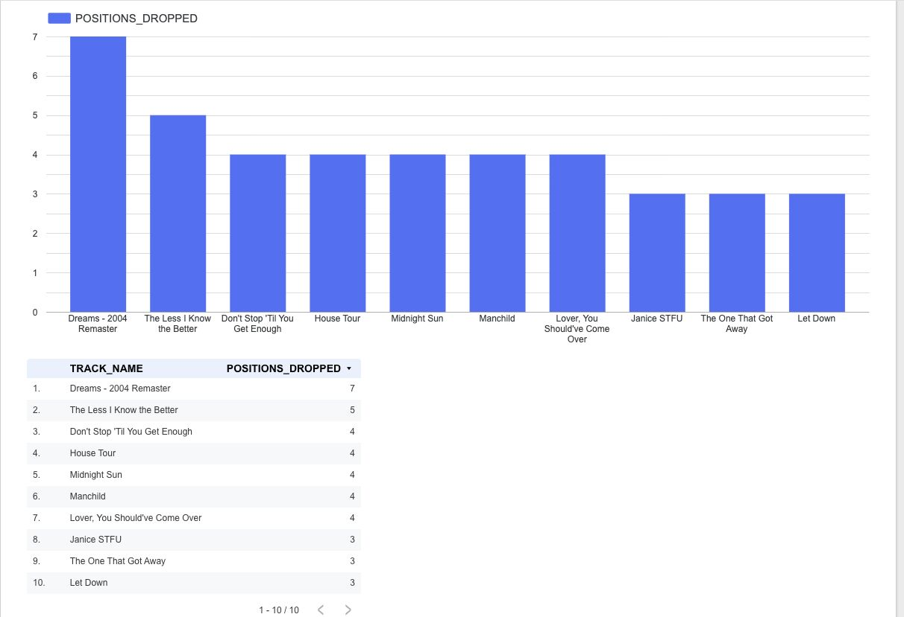
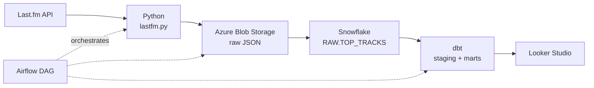

# Last.fm Chart Drops Pipeline

A batch data pipeline that tracks the Last.fm global Top 50 and answers one question:

> **Which tracks dropped the most positions in the last two days?**

Built as the final project for the Data Engineering course of the Data Analyst programme at Hyper Island.

---

## What it does

Each run pulls the current Last.fm global Top 50, stores the raw JSON, loads it into a warehouse, and compares every track's position against its previous appearance. The tracks that fell furthest surface in the final table.

**Sample result** — on the submission date, the biggest faller was *Dreams (2004 Remaster)* by Fleetwood Mac, down 7 positions.

<!-- Add a dashboard screenshot here: -->
<!--  -->

---

## Architecture



The Airflow DAG (`dags/lastfm_pipeline.py`) runs three sequential tasks: fetch and upload to Azure, `COPY INTO` Snowflake, then `dbt run`.

### dbt models

| Model | Type | What it does |
|---|---|---|
| `stg_top_tracks` | view | Flattens the nested API JSON with `LATERAL FLATTEN`; deduplicates with `ROW_NUMBER()` partitioned by track and date |
| `fct_chart_drops` | table | Uses `LAG()` to compare each track's position against its previous appearance, filtered to the last two days |

---

## Tech stack

- **Ingestion:** Python, Last.fm API
- **Storage:** Azure Blob Storage
- **Warehouse:** Snowflake
- **Transformation:** dbt (Core + Cloud)
- **Orchestration:** Apache Airflow via Astro CLI + Docker
- **Visualisation:** Looker Studio

---

## Repo structure

```
.
├── dags/
│   └── lastfm_pipeline.py          # Airflow DAG — fetch, load, transform
├── lastfm.py                       # Last.fm API client and Azure upload
├── lastfm_dbt/
│   ├── models/
│   │   ├── staging/
│   │   │   ├── sources.yml
│   │   │   └── stg_top_tracks.sql
│   │   └── marts/
│   │       └── fct_chart_drops.sql
│   └── dbt_project.yml
├── Dockerfile                      # Astro runtime image
├── requirements.txt
└── .env.example                    # Required environment variables
```

---

## Running it locally

Requires Docker Desktop, the [Astro CLI](https://www.astronomer.io/docs/astro/cli/install-cli), and accounts for Last.fm, Azure and Snowflake.

```bash
# 1. Clone
git clone https://github.com/Boiler82/lastfm-pipeline.git
cd lastfm-pipeline

# 2. Set your environment variables
cp .env.example .env
# then fill in your own values
```

`.env` holds two variables:

| Variable | Where to get it |
|---|---|
| `LASTFM_API_KEY` | [last.fm/api/account/create](https://www.last.fm/api/account/create) |
| `AZURE_CONNECTION_STRING` | Azure Portal → Storage account → Access keys |

Snowflake credentials are **not** in `.env` — dbt reads them from `~/.dbt/profiles.yml`, outside this repo. See the [dbt Snowflake setup docs](https://docs.getdbt.com/docs/core/connect-data-platform/snowflake-setup).

```bash
# 3. Start Airflow
astro dev start

# 4. Trigger the DAG at localhost:8080
```

---

## What I learned

**Deduplication belongs upstream.** Repeated `COPY INTO ... FORCE = TRUE` loads produced duplicate rows. Instead of patching the final table, I fixed it in the staging model with `ROW_NUMBER()` — so every downstream model inherits clean data.

**Filenames can carry metadata.** Reloading historical files overwrote the load timestamps. Parsing the timestamp back out of the blob filename with `SUBSTR(SPLIT_PART(METADATA$FILENAME, '/', -1), 19, 16)` preserved the real chart dates.

**Credential hygiene is a process, not a one-off.** I committed config files containing secrets partway through the project. Recovering meant rewriting history and rotating every credential on both Azure and Snowflake. `.env` now goes into `.gitignore` before the first commit of anything I start.

---

## Next steps

- [ ] Move orchestration off local Docker to GitHub Actions or Astro Cloud
- [ ] Add dbt tests with business-logic assertions, not just `not_null` and `unique`
- [ ] Add dbt source freshness checks
- [ ] Extend beyond chart drops — biggest climbers, longest-charting tracks, artist-level trends

---

## Credits

Built on the batch ingestion template from the Hyper Island Data Engineering course ([abrahamzetz/hyper-island-batch-ingestion](https://github.com/abrahamzetz/hyper-island-batch-ingestion)). The Last.fm ingestion, dbt models and Airflow DAG are my own work.

---

Built by Fabio Boila, data analyst student at Hyper Island, Stockholm.
[LinkedIn](https://www.linkedin.com/in/fabioboila)
