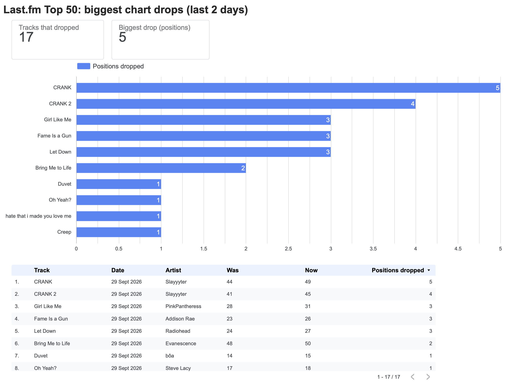
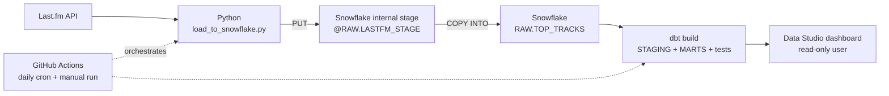
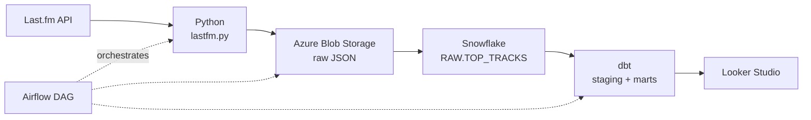

# Last.fm Chart Drops Pipeline

[](https://github.com/Boiler82/lastfm-pipeline/actions/workflows/pipeline.yml)

A batch data pipeline that tracks the Last.fm global Top 50 and answers one question:

> **Which tracks dropped the most positions in the last two days?**

Built as the final project for the Data Engineering course of the Data Analyst programme at Hyper Island, then **migrated from Airflow on my laptop to GitHub Actions** so it runs every day in the cloud.

---

## What it does

Each run pulls the current Last.fm global Top 50, stores the raw JSON, loads it into a warehouse, and compares every track's position against its previous appearance. The tracks that fell furthest surface in the final table.

**Sample result**: on 29 September 2026, 17 tracks in the Top 50 fell compared with the day before. The biggest faller was *CRANK* by Slayyyter, from #44 to #49.



The dashboard is built in Google Data Studio (formerly Looker Studio) on top of `MARTS.FCT_CHART_DROPS`, and refreshes every 12 hours.

---

## Architecture (current)


```mermaid
flowchart LR
    A[Last.fm API] --> B[Python<br/>load_to_snowflake.py]
    B -- PUT --> C[Snowflake internal stage<br/>@RAW.LASTFM_STAGE]
    C -- COPY INTO --> D[Snowflake<br/>RAW.TOP_TRACKS]
    D --> E[dbt build<br/>STAGING + MARTS + tests]
    E --> F[Data Studio dashboard<br/>read-only user]
    G[GitHub Actions<br/>daily cron + manual run] -.orchestrates.-> B
    G -.-> E
```

The workflow (`.github/workflows/pipeline.yml`) runs every day at 06:17 UTC and can also be started by hand from the Actions tab:

1. **Extract**: call the Last.fm API and save a timestamped JSON file.
2. **Load**: `PUT` the file into a Snowflake internal stage, then `COPY INTO` the raw table. The load timestamp is parsed from the file name, so reloaded historical files keep their real date.
3. **Transform + test**: `dbt build` creates the models and runs every data test in dependency order. If a test fails, the run turns red.
4. **Archive**: the raw JSON is kept as a downloadable workflow artifact for 30 days.
5. **Visualise**: Data Studio reads `MARTS.FCT_CHART_DROPS` through a separate read-only service user (`LASTFM_REPORTING_USER`), also with key-pair auth.

### dbt models

| Model | Schema | Type | What it does |
|---|---|---|---|
| `stg_top_tracks` | STAGING | view | Flattens the nested API JSON with `LATERAL FLATTEN`; deduplicates with `ROW_NUMBER()` partitioned by track and date |
| `fct_chart_drops` | MARTS | table | Uses `LAG()` to compare each track's position against its previous appearance, filtered to the last two days |

**Tests:** `not_null` on the raw source columns; `not_null` on track, artist, position and timestamp in the staging model; `unique` on track + date to prove the deduplication works.

---

## Migrated from Airflow to GitHub Actions

The first version ran on Apache Airflow (Astro CLI + Docker) on my laptop, with Azure Blob Storage as the landing zone:


```mermaid
flowchart LR
    A[Last.fm API] --> B[Python<br/>lastfm.py]
    B --> C[Azure Blob Storage<br/>raw JSON]
    C --> D[Snowflake<br/>RAW.TOP_TRACKS]
    D --> E[dbt<br/>staging + marts]
    E --> F[Looker Studio]
    G[Airflow DAG] -.orchestrates.-> B
    G -.-> C
    G -.-> E
```

It worked, but only while my laptop was on, and it depended on two trial accounts (Azure and Snowflake). To make it something I can show running at any time, I moved it to the cloud:

| | Before | After | Why |
|---|---|---|---|
| **Orchestration** | Airflow in Docker on my laptop | GitHub Actions (daily cron) | Runs without my laptop; free for public repos; the run history is visible to anyone |
| **Landing zone** | Azure Blob Storage + external stage | Snowflake internal stage | One less cloud account to maintain; the same `COPY INTO` logic works unchanged |
| **Authentication** | Username + password | Key-pair auth for a `TYPE = SERVICE` user | Snowflake no longer allows password login for pipelines; keys can't be phished or reused |
| **Secrets** | `.env` + `~/.dbt/profiles.yml` | GitHub Secrets, read as environment variables | Nothing sensitive in the repo; `dbt_profiles/profiles.yml` only contains `env_var()` placeholders |
| **Permissions** | Personal admin role | `LASTFM_PIPELINE_ROLE` (write) and `LASTFM_REPORTING_ROLE` (read-only) | Least privilege: the pipeline can load `RAW` and build `STAGING`/`MARTS`; the dashboard can only read `STAGING`/`MARTS` |
| **Dashboard** | Looker Studio with a password login | Data Studio via a read-only service user | A BI tool should never hold write or admin rights; future grants keep access working after each dbt rebuild |
| **dbt** | `dbt run` | `dbt build` | Tests now run on every load, not only when I remember |

The original DAG (`dags/lastfm_pipeline.py`) and `lastfm.py` are kept in the repo for reference.

---

## Tech stack

- **Ingestion:** Python, Last.fm API
- **Warehouse:** Snowflake (internal stage, key-pair auth, dedicated role and service user)
- **Transformation & testing:** dbt Core
- **Orchestration:** GitHub Actions (originally Apache Airflow via Astro CLI + Docker)
- **Visualisation:** Google Data Studio (formerly Looker Studio)

---

## Repo structure

```
.
├── .github/workflows/
│   └── pipeline.yml                # GitHub Actions: daily extract, load, dbt build
├── load_to_snowflake.py            # Last.fm API → internal stage → COPY INTO
├── snowflake/
│   ├── snowflake_setup.sql         # One-time setup: warehouse, schemas, stage, pipeline role + user
│   └── reporting_setup.sql         # Read-only role + user for the Data Studio dashboard
├── dbt_profiles/
│   └── profiles.yml                # dbt connection, all values from environment variables
├── lastfm_dbt/
│   ├── macros/
│   │   └── generate_schema_name.sql  # build into STAGING / MARTS exactly
│   ├── models/
│   │   ├── staging/
│   │   │   ├── sources.yml
│   │   │   ├── stg_top_tracks.sql
│   │   │   └── stg_top_tracks.yml  # model tests
│   │   └── marts/
│   │       └── fct_chart_drops.sql
│   └── dbt_project.yml
├── requirements-pipeline.txt       # packages for the GitHub Actions run
├── .env.example                    # variables for running locally
│
│   Original Airflow version (kept for reference)
├── dags/lastfm_pipeline.py         # Airflow DAG
├── lastfm.py                       # Last.fm client + Azure upload
├── Dockerfile                      # Astro runtime image
└── requirements.txt
```

---

## Running it yourself

### 1. Snowflake (once)

Run `snowflake/snowflake_setup.sql` in a Snowsight worksheet. It creates the warehouse, database, schemas, raw table, internal stage, role and service user. Then create a key pair and attach the public key to the service user:

```bash
openssl genrsa 2048 | openssl pkcs8 -topk8 -inform PEM -out rsa_key.p8 -nocrypt
openssl rsa -in rsa_key.p8 -pubout -out rsa_key.pub
```

```sql
ALTER USER LASTFM_PIPELINE_USER SET RSA_PUBLIC_KEY = '<contents of rsa_key.pub without the BEGIN/END lines>';
```

### 2. GitHub Actions

Add four repository secrets under **Settings → Secrets and variables → Actions**:

| Secret | Value |
|---|---|
| `LASTFM_API_KEY` | from [last.fm/api/account/create](https://www.last.fm/api/account/create) |
| `SNOWFLAKE_ACCOUNT` | account identifier, e.g. `ORGNAME-ACCOUNTNAME` |
| `SNOWFLAKE_USER` | `LASTFM_PIPELINE_USER` |
| `SNOWFLAKE_PRIVATE_KEY` | full contents of `rsa_key.p8` |

Then go to **Actions → Last.fm pipeline → Run workflow**.

### 3. Locally (optional)

```bash
cp .env.example .env              # fill in your values
pip install -r requirements-pipeline.txt
python load_to_snowflake.py
dbt build --project-dir lastfm_dbt --profiles-dir dbt_profiles
```

Load old raw files (for example from a workflow artifact) without calling the API:

```bash
python load_to_snowflake.py --backfill data
```

---

## What I learned

**Deduplication belongs upstream.** Repeated `COPY INTO ... FORCE = TRUE` loads produced duplicate rows. Instead of patching the final table, I fixed it in the staging model with `ROW_NUMBER()`, so every downstream model inherits clean data. The new loader drops `FORCE` completely and relies on Snowflake's load history, so a re-run never loads the same file twice.

**Filenames can carry metadata.** Reloading historical files overwrote the load timestamps. Parsing the timestamp back out of the filename with `SUBSTR(SPLIT_PART(METADATA$FILENAME, '/', -1), 19, 16)` preserved the real chart dates. The same trick survived the move from Azure to an internal stage unchanged.

**Credential hygiene is a process, not a one-off.** I committed config files containing secrets partway through the project. Recovering meant rewriting history and rotating every credential on both Azure and Snowflake. In the new version there are no passwords at all: a service user logs in with a private key that only exists in GitHub Secrets.

**Tests belong where the columns are.** My first `sources.yml` tested `track_name` and `chart_position` on the raw table, but those columns only exist after the JSON is flattened. Moving the tests to the staging model, and switching from `dbt run` to `dbt build`, means data quality is checked on every run.

---

## Next steps

- [x] Move orchestration off local Docker to GitHub Actions
- [ ] Add dbt tests with business-logic assertions, not just `not_null` and `unique`
- [ ] Add dbt source freshness checks
- [x] Reconnect the dashboard (now Data Studio) to the new Snowflake account with a read-only user
- [ ] Extend beyond chart drops: biggest climbers, longest-charting tracks, artist-level trends

---

## Credits

Built on the batch ingestion template from the Hyper Island Data Engineering course ([abrahamzetz/hyper-island-batch-ingestion](https://github.com/abrahamzetz/hyper-island-batch-ingestion)). The Last.fm ingestion, dbt models, Airflow DAG and GitHub Actions migration are my own work.

---

Built by Fabio Boila, data analyst student at Hyper Island, Stockholm.
[LinkedIn](https://www.linkedin.com/in/fabioboila)
